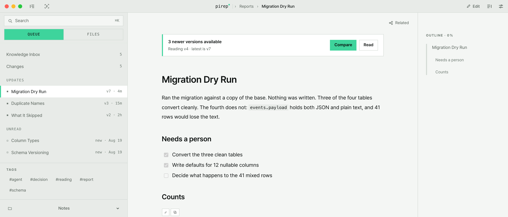
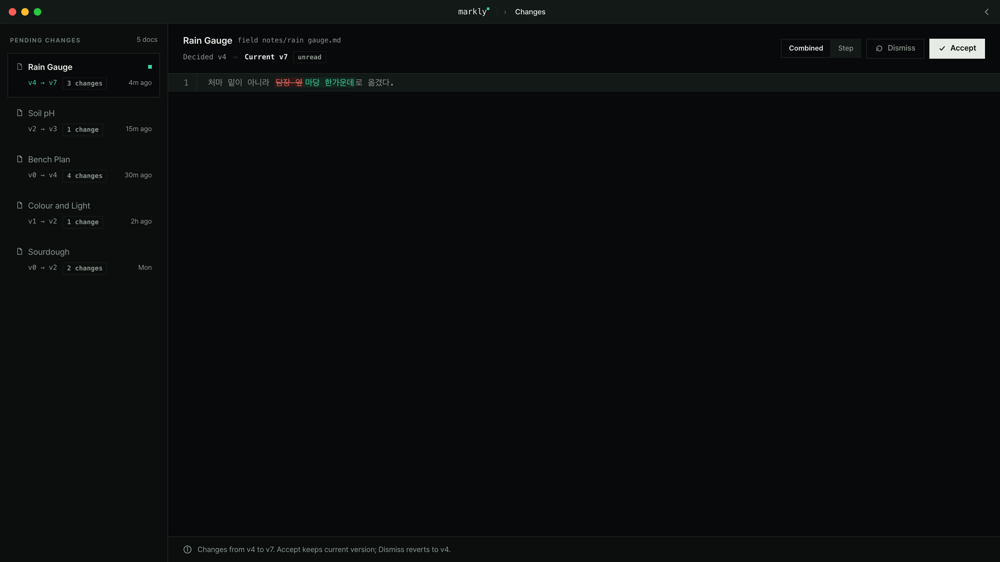

# Markly

로컬 폴더에 쌓인 Markdown 문서를 읽기 좋게 보여 주고, **내가 안 보는 사이에 누가 고쳤는지** 알려 주는 macOS 앱.



## 이런 상황을 위한 앱

메모와 문서를 폴더에 Markdown 파일로 쌓아 두고, 그 파일을 사람만 고치는 게 아니라 AI 도구나 스크립트, 동기화 폴더도 같이 고친다면 — 어제 읽은 문서가 오늘 달라져 있어도 알아채기 어렵습니다.

Markly는 폴더 하나를 맡아서 이렇게 해 줍니다.

- 문서를 **읽기 좋은 모양**으로 보여 줍니다. 표, 코드, 수식, 다이어그램, 체크리스트 그대로.
- 밖에서 파일이 바뀌면 **새 버전으로 기록**해 둡니다.
- 내가 마지막으로 읽은 버전과 지금 파일을 **단어 단위로 비교**해 보여 줍니다.
- 확인했으면 "읽음"으로 넘기고, 마음에 안 들면 **이전 내용으로 되돌립니다**.

서버도, 로그인도, 클라우드도 없습니다. 파일은 내 컴퓨터 폴더에 그대로 있고, 앱은 그걸 읽을 뿐입니다.

## 무엇이 들어 있나

| 하는 일 | 설명 |
|---|---|
| 읽기 | 표·코드 강조·수식·mermaid 다이어그램·체크박스·콜아웃·위키 링크 |
| 변경 추적 | 폴더를 지켜보다가 파일이 바뀌면 버전을 올리고 목록에 띄움 |
| 비교 | 바뀐 곳을 단어 단위로. 여러 번 바뀌었으면 한 번에 보거나 한 단계씩 |
| 되돌리기 | 예전 버전 내용을 다시 파일로 |
| 편집 | `⌘E` 로 원문 편집, 1.2초 뒤 자동 저장 |
| 다른 파일도 | PDF·이미지·CSV·HTML·코드 파일 보기. HTML 슬라이드와 PDF는 전체 화면 발표까지 |
| 찾기 | `⌘K` 문서 이름·명령 찾기, `⌘F` 지금 문서 안에서 찾기 |



## 쓰는 순서

1. 앱을 열고 **폴더 하나를 고릅니다**(Markly는 이 폴더를 "Base"라고 부릅니다).
2. 왼쪽 목록에서 문서를 고르면 바로 읽힙니다.
3. 밖에서 파일이 바뀌면 왼쪽 **Changes** 에 뜹니다. 눌러서 무엇이 달라졌는지 보고, "읽음"으로 넘기거나 되돌립니다.
4. 고칠 게 있으면 `⌘E`.

## 설치

1. [릴리스 페이지](https://github.com/garamnohhh/markly/releases/latest)에서 `Markly_0.1.0_aarch64.dmg` 를 내려받습니다.
2. 받은 dmg 를 두 번 눌러 엽니다.
3. 창 안의 **Markly** 를 옆의 **Applications** 폴더로 끌어다 놓습니다.
4. 응용 프로그램에서 Markly 를 엽니다.

### 처음 열 때 "열 수 없습니다" 가 뜨면

애플에 돈을 내고 받는 서명이 없는 앱이라, macOS가 처음 한 번 막습니다. 앱이 고장 난 게 아닙니다.

1. 경고 창을 닫습니다.
2. **시스템 설정 → 개인정보 보호 및 보안** 을 엽니다.
3. 아래로 내리면 "Markly 은(는) 확인되지 않은 개발자가 배포했기 때문에 차단되었습니다" 같은 줄이 있습니다. 옆의 **그래도 열기** 를 누릅니다.
4. 한 번 더 물어보면 **열기**.

이 과정은 처음 한 번뿐입니다. 그다음부터는 그냥 열립니다.

### 알아 두면 좋은 것

- **Apple Silicon 맥 전용**입니다(M1 이후). 인텔 맥에서는 돌아가지 않습니다.
- macOS 26 에서 만들었고, 27 로 올린 뒤에도 문제없이 쓰고 있습니다.
- 지금 올라간 `0.1.0` 은 **2026-09-11 에 만든 빌드**입니다. 그 뒤에 고친 것(표 편집, 파일 이름 변경, 문서 안 상대경로 링크 등)은 이 설치 파일에 들어 있지 않습니다. 최신 상태로 쓰려면 아래 "소스에서 직접 빌드하기" 를 보세요.

## 소스에서 직접 빌드하기

필요한 것: [Node.js](https://nodejs.org) · [pnpm](https://pnpm.io) · [Rust](https://rustup.rs) · Xcode Command Line Tools

```bash
pnpm install
pnpm tauri dev     # 개발 모드로 실행
pnpm tauri build   # 설치용 .app 과 .dmg 만들기
```

## 내 파일과 정보는 어디에 있나

- **문서**: 내가 고른 폴더에 그대로. Markly가 다른 곳으로 옮기지 않습니다.
- **변경 기록**: 그 폴더 안 `.markly/` 폴더에. 버전별 사본과 변경 내역이 들어갑니다. 폴더를 지우면 기록도 같이 사라집니다.
- **앱 설정**: 맥 안 앱 저장소(`~/Library/WebKit/com.garamnoh.markly`)에.
- **밖으로 나가는 것**: 없습니다. 이 앱에는 인터넷으로 무언가를 보내는 코드가 없습니다.

지우고 싶으면 앱을 휴지통에 넣고, 원하면 폴더 안 `.markly/` 와 위 설정 폴더를 지우면 끝입니다.

## 무엇으로 만들었나

[Tauri 2](https://tauri.app)(Rust) + React 19 + TypeScript. 문서 렌더링은 markdown-it, 코드 강조는 Shiki, 수식은 KaTeX, 다이어그램은 Mermaid.

## 라이선스

[Apache License 2.0](LICENSE). 같이 담긴 폰트의 라이선스는 [THIRD-PARTY-NOTICES.md](THIRD-PARTY-NOTICES.md) 에 적어 두었습니다.

---

## In short (English)

Markly is a macOS app for reading a local folder of Markdown files — and for noticing when something else changed them.

It watches the folder, keeps a version each time a file changes outside the app, and shows you a word-level diff against the version you last read. You mark it read, or roll it back. No server, no account, no cloud: your files stay where they are.

Apple Silicon only. Built on macOS 26, still fine on 27. Download the dmg from the [latest release](https://github.com/garamnohhh/markly/releases/latest) and drag Markly into Applications. The app is not signed or notarised, so the first launch needs **System Settings → Privacy & Security → Open Anyway** — once, then it opens normally. The published `0.1.0` is a 2026-09-11 build and does not include later fixes; build from source with `pnpm install && pnpm tauri build` for the current code.

Licensed under [Apache-2.0](LICENSE); bundled font licences are listed in [THIRD-PARTY-NOTICES.md](THIRD-PARTY-NOTICES.md).
